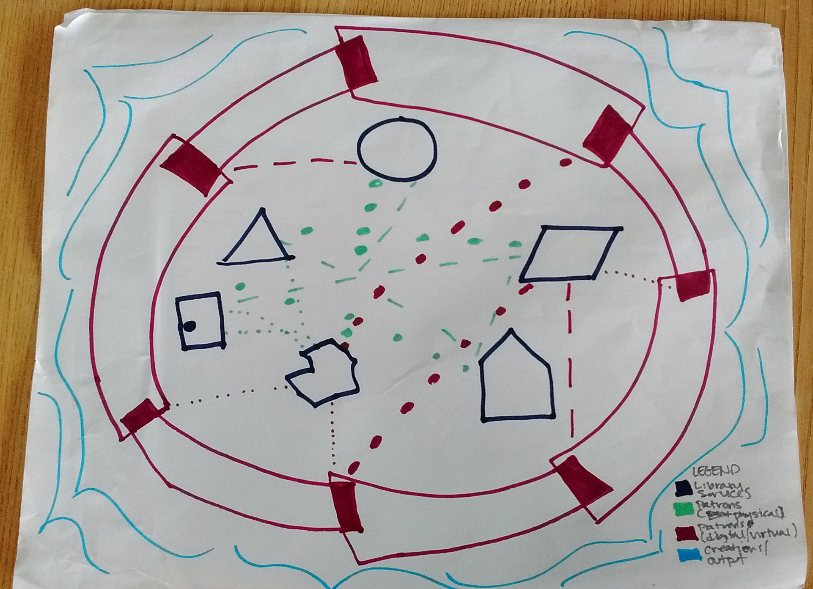
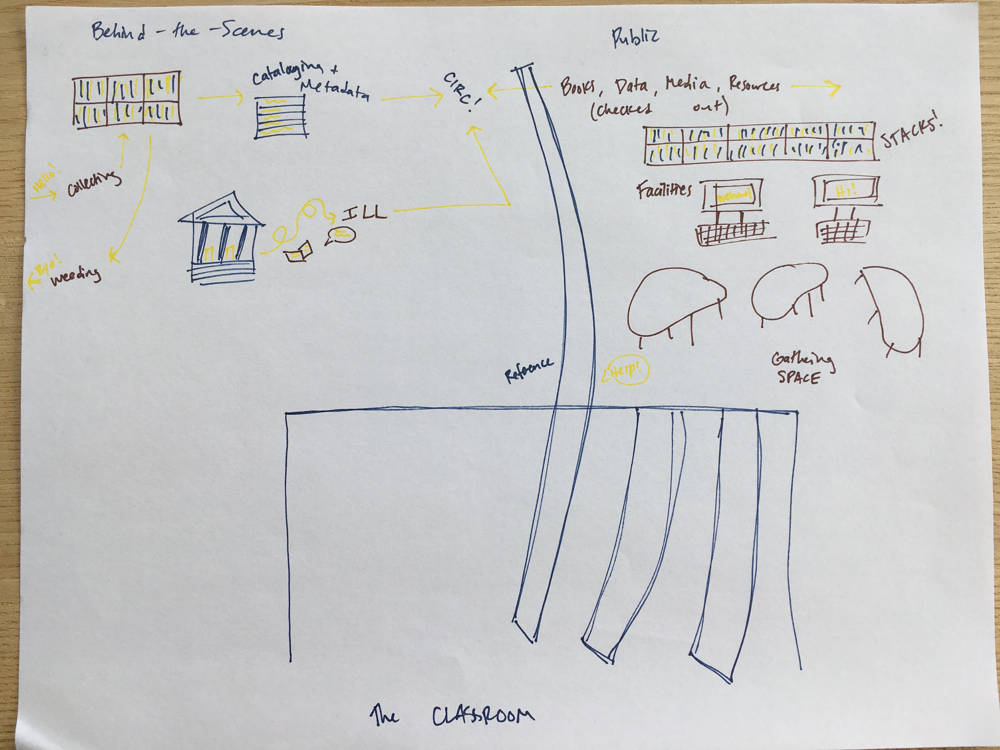
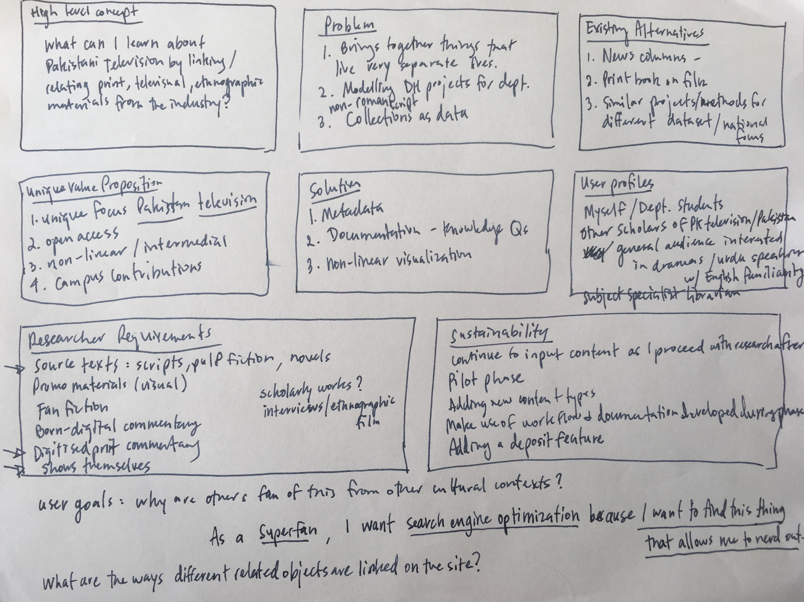

## Concepts and Models

Here is an overview of the broad concepts and models that we worked on this week: 

### What is a library?
We each did drawings that represented functions and services of the library. Here are the two that survived the week:
</img>
by Lauren Cooper

 </img>
by Claire Cahoon

### The Pyramid 
The pyramid is a model for developing and offering library services. The steps are:
4. Research and Development: experiments that are the first of their kind
3. Apply for This: enhanced research services that are custom-designed with the library's digital scholarship team
2. Everyone Gets Upon Request: standard research services that are available to everyone if they ask for it. (examples: institutional repository, ILL, standard web publishing platforms, data analysis consultations)
1. Everyone Gets Without Asking: Standard academic and administrative services that the library offers to all (examples: wikis, libguides, media streaming, library catalog)

Here are our drawings of the pyramid:

### Project Planning
We worked through how to manage projects (our own and for others) and best practices for making a project plan. We then moved through two different project planning tools:
* [Socio-technical Sustainability Roadmap](https://sites.haa.pitt.edu/sustainabilityroadmap/)
* [Yale DH Lab - Starting a Project](http://dhlab.yale.edu/guides.html)

We all created plans for our own projects!

by Elliot Montpellier
