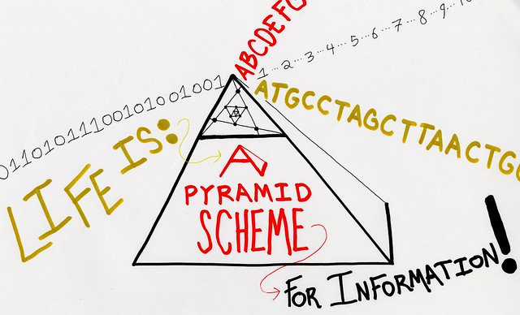

---
# Feel free to add content and custom Front Matter to this file.
# To modify the layout, see https://jekyllrb.com/docs/themes/#overriding-theme-defaults

layout: default
---
## Expansive & Inclusive Digital Scholarly Production in the Library
Members: Michelle Byrnes, Claire Cahoon, Anastasia Chiu, Lauren Cooper, Benjamin Dupriest, Elliot Montpellier
Instructor: Laurie Allen

**The Expansive & Inclusive Digital Scholarly Production in the Library** class brought together library workers and scholars in the arts and humanities. Together, we explored broad models and concepts related to library work and scholarship, as well as common tools and methods used in digital humanities work. In the course of this exploration, we problematized systems and structures of oppression, and began to blur the traditional lines between heady conceptual work and nitty-gritty tools.

#### [Concepts and Models](concepts.html)

#### [Tools and Methods](methods.html)

