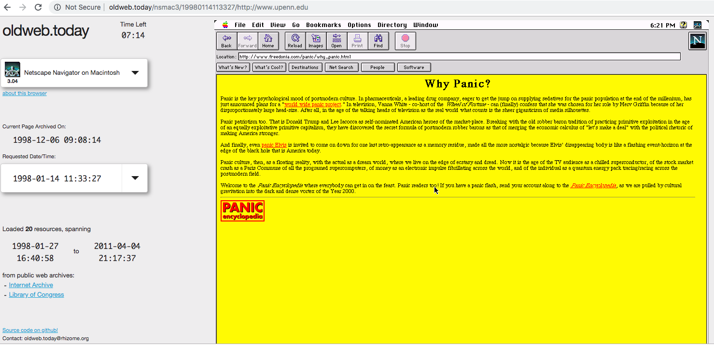
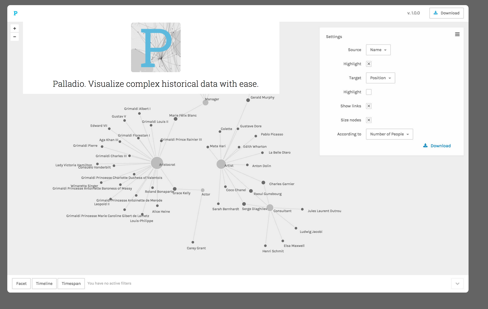
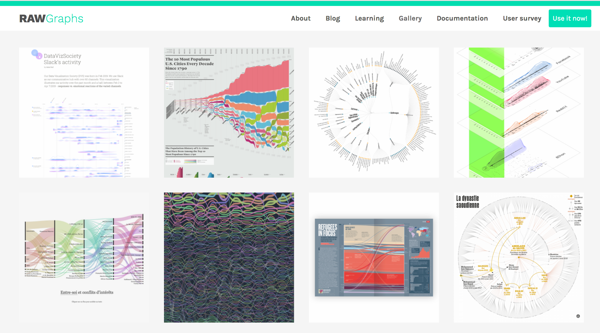
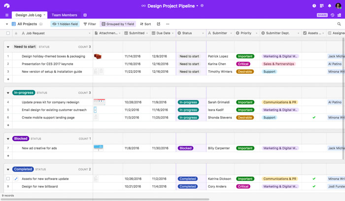

## Tools and Methods

We explored a smattering of tools and methods spanning digital publishing, data management and visualization

Below are just some of the stuff we have a greater hunger to learn more about.

### Scholarly Communications

We had the amazing Sarah Wipperman, Schol Comm Librarian at Penn Libraries come talk with us about about her work and some of the tools designed by her and the Digital Scholarship team and Penn.

Reference Interview

### Website Archiving and Digital Preservation

### Data Visualization

We explored [Palladio](http://hdlab.stanford.edu/palladio/) and [Raw Density Tools](https://app.rawgraphs.io/) with data from the [Monument Lab project](https://monumentlab.com/projects). 

#### Palladio

#### Raw Graphs

### Data Management

We were working for the most part with the text editor [Atom](https://atom.io/). 

We also explored the really great spreadsheet-database hybrid, [Airtable](https://airtable.com/), a propietary software that makes working with data across spreadsheets much easier than Excel. 

Finally, if you have done really excellent work and need to make your host your own website, we talked a lot about the great services offered by [Reclaim Hosting](https://reclaimhosting.com/), which was started by some great EdTech folks and has great integration with a lot of content management tools and other great things. Check them out!

### Project Planning and Management

[Liberating Structures Website](http://www.liberatingstructures.com/)

### Publishing 

We discussed the great tools for self-publishing: Jekyll (including the great themes **Ed** and **Wax**), Omeka, Scalar. 
Also some great larger publishing tools: Manifold, Fulcrum, and Stanford's custom platform.

###  
